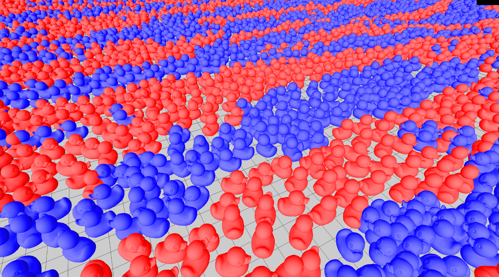

# Real-Time Crowd Simulation in WebGPU

**University of Pennsylvania, CIS 565: GPU Programming and Architecture, Final Project**

by [Ashley Alexander-Lee](), [Matt Elser](), and [Wayne Wu](https://www.wuwayne.com/).

## Overview
This project attempts to implement a real-time crowd simulation based on the paper: [Position-Based Real-Time Simulation of Large Crowds](https://tomerwei.github.io/pdfs/mig2017.pdf). 
Unlike the paper which uses CUDA and Unreal Engine for simulation and rendering,
this project uses WebGPU for both.

## Neighbor Searching

## Position-Based Dynamics
The main solver used in the paper is Position-based Dynamics with Jacobi Solver, which can be parallelized very easily.

### Short Range Collision
The first constraint applied is a simple collision constraint model for short range collision.
This resolves the immediate collisions between neighboring agents to prevent penetration.

### Long Range Collision
Long range collision constraint is used to enable agents to look ahead in the future for possible collisions.
The constraint will predict the position of neighboring agents at a specified future time and resolve any collision at the future position.
As shown in the image below, the agents start reacting before they are even close to colliding.

### Long Range Collision w/ Avoidance Model

### Frictional Contact

### Cohesion

### Obstacles Avoidance

### Parameters Tuning

## Rendering

## Test Scenes

Installation
============
1. Clone this repo
2. Run `npm i`
3. Build with `npm run-script build`
4. Start with `npm start`
5. Must view using Google Chrome Canary or Chrome Developer
6. Be sure to `--enable-unsafe-webgpu` in the Chrome Settings

References
==========
- Base code from this [Particles WebGPU sample](https://github.com/austinEng/webgpu-samples) by Austin Eng
- [3d-view-controls](https://www.npmjs.com/package/3d-view-controls) for camera manipulation
- Camera class referenced from UPenn's CIS566 base code, written by Adam Mally
- [dat-gui](https://github.com/dataarts/dat.gui) for gui controls
