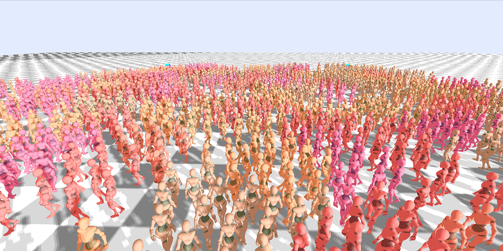
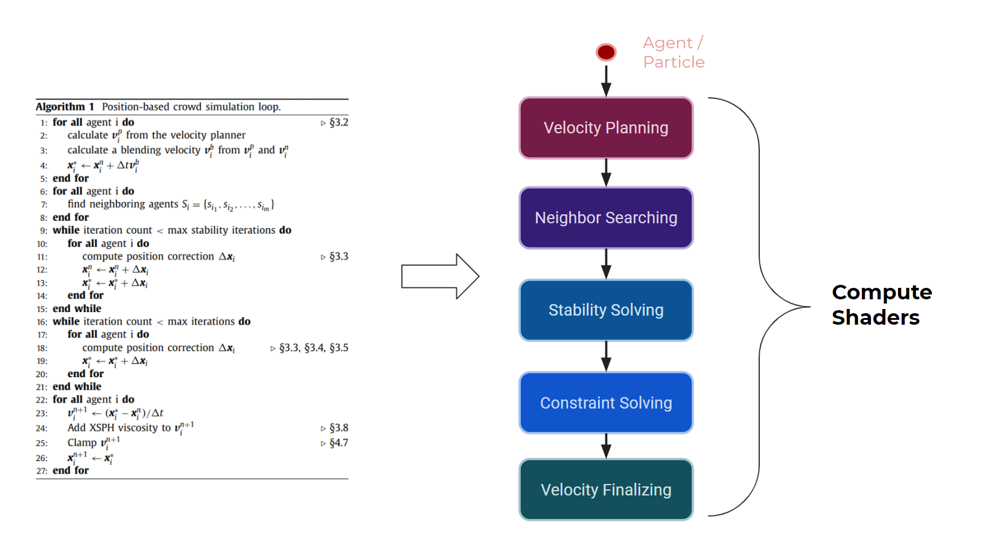
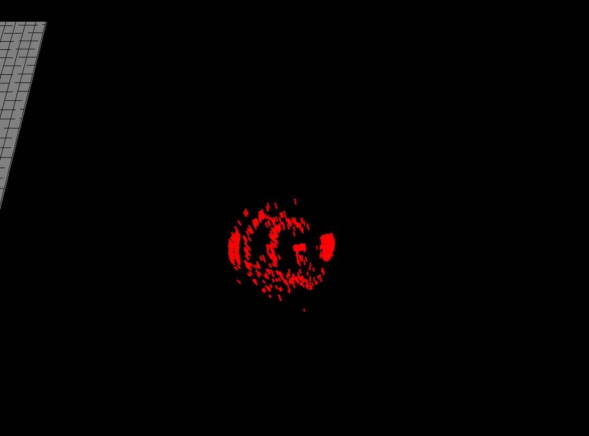

# Real-Time Crowd Simulation in WebGPU

**University of Pennsylvania, CIS 565: GPU Programming and Architecture, Final Project**

by [Ashley Alexander-Lee](), [Matt Elser](), and [Wayne Wu](https://www.wuwayne.com/).

[**Check it out live! (WebGPU Required)**](https://www.wuwayne.com/webgpu-crowd-simulation/)

Installation
============
1. Clone this repo
2. Run `npm i`
3. Build with `npm run-script build`
4. Start with `npm start`
5. Must view using Google Chrome Canary or Chrome Developer
6. Be sure to `--enable-unsafe-webgpu` in the Chrome Settings

Usage
=====
**Camera Controls**
- `Left Mouse Hold and Move`: change camera orientation
- `Right Mouse Hold and Move`: pan camera
- `Scroll in/out`: zoom in/out
- `resetCamera`: gui control to reset camera to the scene's default

**Grid Controls**
- `gridWidth`: change the number of divisions of the hash grid (hash grid size is constant)
- `gridOn`: turn the grid checkerboard visualization on or off

**Scene Controls**
- `scene`: choose the scene configuration, which changes the number of agents, agent goals, camera default, and platform width
- `model`: choose which model to use
- `showGoals`: show where the agent goals are (marked with rainbow spheres)
- `shadowOn`: show the agent shadows
- `agent selector`: choose the number of agents in powers of 2 (only supported in dense and sparse scenes)

**Simulation Controls**
- `simulate`: start/stop simulation
- `deltaTime`: the time step to use in the simulation
- `lookAhead`: parameter that affects how far the agents look ahead to plan their trajectory
- `avoidanceModel`: use the avoidance model, which allows agents to move in a more tangential direction when stuck in a dense area
- `resetSimulation`: reset the simulation

Overview
===========
This project attempts to implement a real-time crowd simulation based on the paper: [Position-Based Real-Time Simulation of Large Crowds](https://tomerwei.github.io/pdfs/mig2017.pdf). 
Unlike the paper which uses CUDA and Unreal Engine for simulation and rendering,
this project uses WebGPU for both.

# Compute Pipeline
In WebGPU, we use compute shaders in replacement of CUDA kernels to simulate the agents. The algorithm can be broken down into five main processes including:

1. **Velocity Planning**: advect the agent based on a calculated velocity field.
2. **Neighbor Searching**: find the nearest neighbor and assign to hash grid.
3. **Stability Solving**: resolve any collisions that remain from the previous time step for stability.
4. **Constraint Solving**: project the main constraints and correct agents' positions.
5. **Velocity Finalizing**: finalize the velocity and update the final position of the agent

## Neighbor Searching
In order to ensure our neighbor finding was efficient, we employed a hash grid neighbor finder, based on [this article](https://developer.download.nvidia.com/assets/cuda/files/particles.pdf). 

*Pictured above: A visualization of the early cell assignments, used to debug our initial implementation*

## Position-Based Dynamics
The core algorithm of the paper is based on Position-based Dynamics with Jacobi Solver.
Unlike the Gauss-Siedel method, the Jacobi solver can be more easily parallelized at the cost of slower convergence. While physically less accurate, PBD is really fast and therefore has been a popular simulation technique for real-time applications.

For more information on PBD, please refer to the [original PBD paper](https://matthias-research.github.io/pages/publications/posBasedDyn.pdf).

### Short Range Collision
The first constraint applied is a simple collision constraint model for short range collision.
This resolves the immediate collisions between neighboring agents to prevent penetration.

### Long Range Collision
Long range collision constraint is used to enable agents to look ahead in the future for possible collisions.
The constraint will predict the position of neighboring agents at a specified future time and resolve any collision at the future position.
As shown in the image below, the agents start reacting before they are even close to colliding. 
User can tweak the **lookAhead** parameter to specify how far ahead to an agent should look ahead for long range collision.

lookAhead = 6         | lookAhead = 12                         
:--------------------:|:------------------:
        |   

### Long Range Collision w/ Avoidance Model
The paper introduces a novel addition to the long range collision constraint that prevents agents from being pushed back, typically in a dense crowd.
The avoidance model considers only the tangential component of the position correction, 
thus removing/reducing the correction along the contact normal (which can push the agent back if two agents are walking towards each other).

Scene         | LR                 |  LR w/ Avoidance                 
:------------:|:------------------:|:-------------------------:
Proximal      |   |       
Dense         |   |  

### Cohesion
Cohesion is added so that agents within the same group will tend to follow each other thus creating smoother packed motions.
When cohesion is **off**, it is more likely to see individual agents wander off alone as shown below.

Debug                        | Cohesion OFF         | Cohesion ON
:---------------------------:|:--------------------:|:----------------------
  | | 

### Obstacles Collision and Avoidance
To add complexity to the scene, we support box-shaped obstacles in our implementation.
The paper showcases walls as obstacles which can be modeled as line segments with short range collision constraint. 
We use a similar approach that considers each edge of the box as a wall constraint.

Furthermore, to enable agents to look ahead in the future and avoid obstacles, 
we implement an obstacle avoidance model based on [OpenSteer](http://opensteer.sourceforge.net). 
This affects the velocity directly in the final stage (similar to cohesion) instead of correcting the position using constraint projection.
While this approach is not specifically outlined in the paper, we suspect the author having something similar based on the result produced.

Obstacles         | Bottleneck                         
:----------------:|:------------------:
        |    

### Parameters Tuning
The author has kindly provided the parameter values used in the paper. Using them as a starting point has given us a reasonable result with very minor tweaks. 
The full list of parameter values used in our implementation can be found in [header.compute.wgsl](https://github.com/wayne-wu/webgpu-crowd-simulation/blob/main/src/shaders/header.compute.wgsl).

# Rendering
## Model Loading
We support several different models in order to produce a visually compelling scene, which you can select via the "models" dropdown in the gui. We used the `GLTFLoader` from [threejs](https://threejs.org/docs/#examples/en/loaders/GLTFLoader) to parse our gltf files, and we use the resulting `gltf` object to create the array buffer that we use in the WebGPU rendering pipeline. Each of the models affects the FPS proportionally to model complexity, with the duck model taking the least time, and the xbot taking the most (TODO: chart showing FPS impact of each model). We were able to borrow the gltf models from the following sources:
- 'Duck' from [threejs](https://github.com/mrdoob/three.js/tree/dev/examples/models/gltf)
- 'Cesium Man' from [Cesium](https://github.com/CesiumGS/cesium)
- 'XBot' from [Mixamo](https://www.mixamo.com/)
- 'Ship', 'Tower', 'Garbage Truck', 'Sedan' from [Kenney Assets](https://kenney.nl/assets?q=3d)

|  |  |
| ------------------------------------------ | ------------------------------------------ |
|  |  |

## Shadow Mapping
We apply basic shadow mapping to the scene based on the provided [WebGPU Example](https://austin-eng.com/webgpu-samples/samples/shadowMapping). We introduce a crowd shadow render pipeline that renders the agents' depth, with respect to the light, into a depth buffer. The texture is then sampled when rendering the ground as well as the agents.

Since our test scenes vary from small/proximal to large/far, and agents' trajectories can span a large area, it is difficult to have consistently clean shadow map across the whole scene. The algorithm should be further optimized using techniques like Cascaded Shadow Mapping.

# Additional Test Scenes

Circle            | Dispersed                      
:----------------:|:------------------:
        |  

Sparse            | Obstacles                      
:----------------:|:------------------:
        |    

# Future Work
* Animation & Skinning
* Cascaded Shadow Mapping
* Separate Grids for Short Range vs. Long Range

References
==========
- Main paper of the project: [PBD Crowd Simulation](https://tomerwei.github.io/pdfs/mig2017.pdf)
- Base code from this [Particles WebGPU sample](https://github.com/austinEng/webgpu-samples) by Austin Eng
- [3d-view-controls](https://www.npmjs.com/package/3d-view-controls) for camera manipulation
- Camera class referenced from UPenn's CIS566 base code, written by Adam Mally
- [dat-gui](https://github.com/dataarts/dat.gui) for gui controls
- WebGPU [shadow mapping example](https://austin-eng.com/webgpu-samples/samples/shadowMapping) by Austin Eng
- WebGPU [documentation](https://www.w3.org/TR/webgpu/)

Bloopers
========
### Upside-down Agents

### Giant Agents

